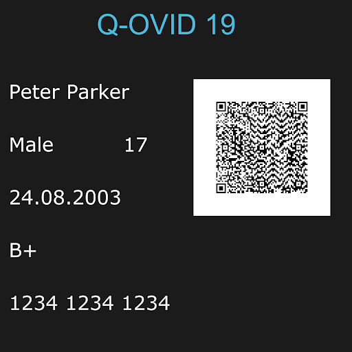
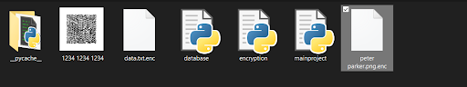
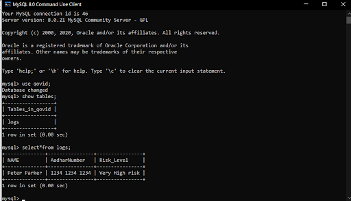

## ID Generator and Encryptor


This project was intended to help keep track of the health of my school-mates during the pandemic.


This python project aims at making it easier to store and relay information about a person’s health information related to COVID-19 consisting of a unique ID token generator with a QR code, generated by the program, which is created based on what the person answers in the questions asked by the app. The implementation of this project is up to the user. A potential suggestion is that the QR code could tell the authorities at small places or institutions about a person’s health, on scanning the QR code. In addition to this, we can also encrypt(or decrypt for that matter) the data through another stand-alone program.

## Description

The Main program uses the Python Imaging Library which draws a picture of the required dimension (in this case of 2000 x 2000 pixels). Certain Other basic libraries are used such as os and datetime. The Unique QR code which is generated unique for every id is created using qrcode library.
 The program starts by asking a few basic questions about your health condition and evaluates it using if and else conditions. All the possible combinations for the health conditions are taken and then some basic questions to check if one is following the basic norms to prevent the spread of coronavirus in public places. 
User is asked about personal information and that text is drawn on the image which was generated at the start of the program. This information creates a unique ID for each person and is stored in a database for analytics and getting to know about the people’s condition over time.  
The image is then saved with the person’s name on it.
QR code is being generated using library ’qrcode’ and calling function ‘make’ so that all the required information about a person can be told via a person’s health. The QR code is saved with a person's aadhar number on it and .bmp extension.
The original image is opened and then the qr code image is pasted at the specified coordinates within the image.
The final image is then saved and can be used as a token now.

We then use the encrypting code through the Crypto library. Encryption works by taking plain text and converting it into cipher text, which is made up of seemingly random characters. Only those who have the special key can decrypt it. AES uses symmetric key encryption, which involves the use of only one secret key to cipher and decipher information. The key is the string that we use to encrypt or decrypt our data. 
In the Encryptor Class, we have created a function for padding called pad. Padding is basically a way to take data that may or may not be multiple of blocksize for a cipher and extend it. AES uses 128 bit blocksize = 16 octet blocksize. So if the string that we want to encrypt is of 10 length but blocksize is 16 so we pad some extra data in the string so that it becomes a multiple of the blocksize.
After adding padding to the message in the “encrypt” function which takes message, key and key_size (=256) as argument, we have created an IV(Initialization Vector) and object for the cipher. After encrypting the string, we append it to the IV. 
The Initialization Vector (IV) is an unpredictable random number used to make sure that when the same message is encrypted twice, the ciphertext is always different. It should be exchanged, in public, as part of the ciphertext. The IV adds randomness to the start of our encryption process. When using a chained block encryption mode (where one block of encrypted data incorporates the prior block of encrypted data) we're left with a problem regarding the first block, which is where the IV comes in.
If we had no IV, and used chained block encryption with just the key, two files that begin with identical text will produce identical first blocks. If the input files changed midway through, then the two encrypted files would begin to look different beginning at that point and through to the end of the encrypted file. If someone noticed the similarity at the beginning, and knew what one of the files began with, he could deduce what the other file began with. Knowing what the plaintext file began with and what it's corresponding ciphertext is could allow that person to determine the key and then decrypt the entire file.
The “encrypt_file” function after that calls the above function, as it reads the data of the file and creates a new file with extension “.enc” where the encrypted data is written. The original file is then deleted.
The decryption process is the reverse of the above described process.
Once this is done, we define the key (in bytes using the b”<string>”  syntax). Notice that “lambda” after a line? That’s an anonymous function, defined without a name as we will be calling it only for a short period of time.
Before creating the command-line interface of the application, we store the password in data.txt.enc. Therefore, if we’re running the program for the first time, we’ll have to enter a permanent password. 

How does the AES algorithm work? Here’s a short explanation...
AES is a 128 bit block cipher. It takes 128 bits of message and encrypts it into 128 bits of cipher with some key. The 128 bits of message is arranged in a 4 x 4 grid on which all the operations are done. First it substitutes bytes then shifts rows and mixes columns and then at the end of each round the key is added. This substitution and permutations makes one iteration or round. 
We put in the key intermittently between the rounds. The key can be 128 bits  - 10 iterations, 192 bits - 12 iterations and 256 bits - 14 iterations. A key is expanded in every iteration.
All operations in AES are mathematical operations in a galois or finite field. So for instance in the Rijndael field we have 2^8 (which is a byte) element that allows +, -, x , /. Each element in this field is a byte (2^8 = byte).

## Snapshots

* ID and QR Code generated:



* Location in Folder



* Record in database




### Dependencies

* Python Imaging Library
* Pycryptodome(windows) or Crypto(Other OS)
* Mysql

### Executing program

Run main.py

[comment]: <> (```)

[comment]: <> (code blocks for commands)

[comment]: <> (```)

[comment]: <> (## Authors)

[comment]: <> (ex. Harshit Singh  )

[comment]: <> (ex. [@DomPizzie]&#40;https://twitter.com/dompizzie&#41;)

## Version History

* 0.1 - 2020
    * Initial Release